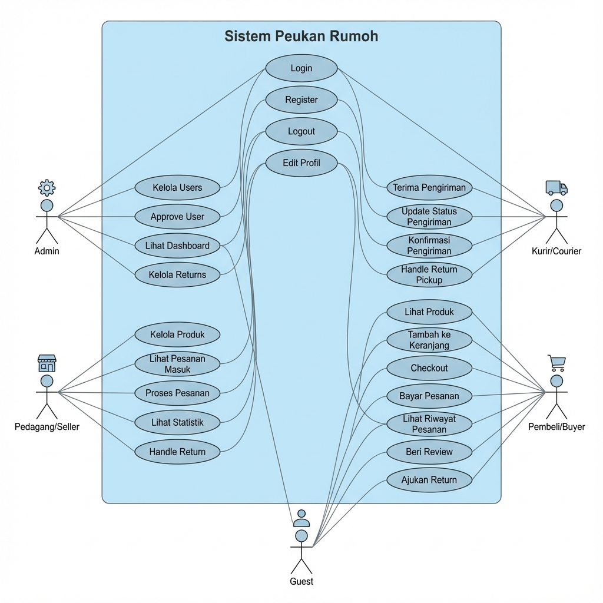
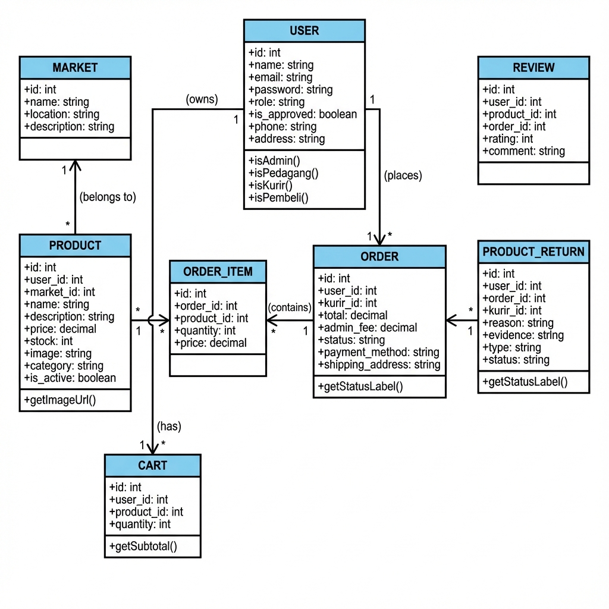
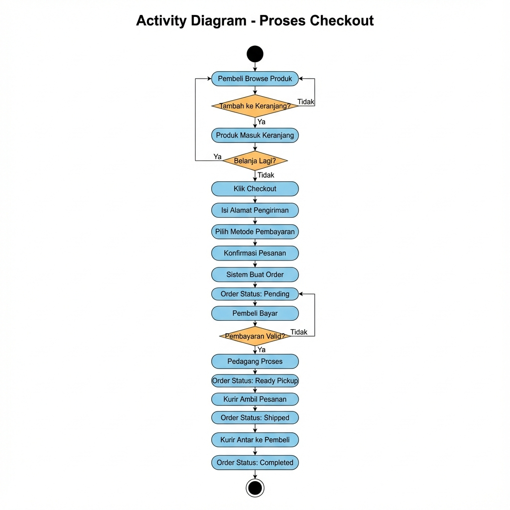
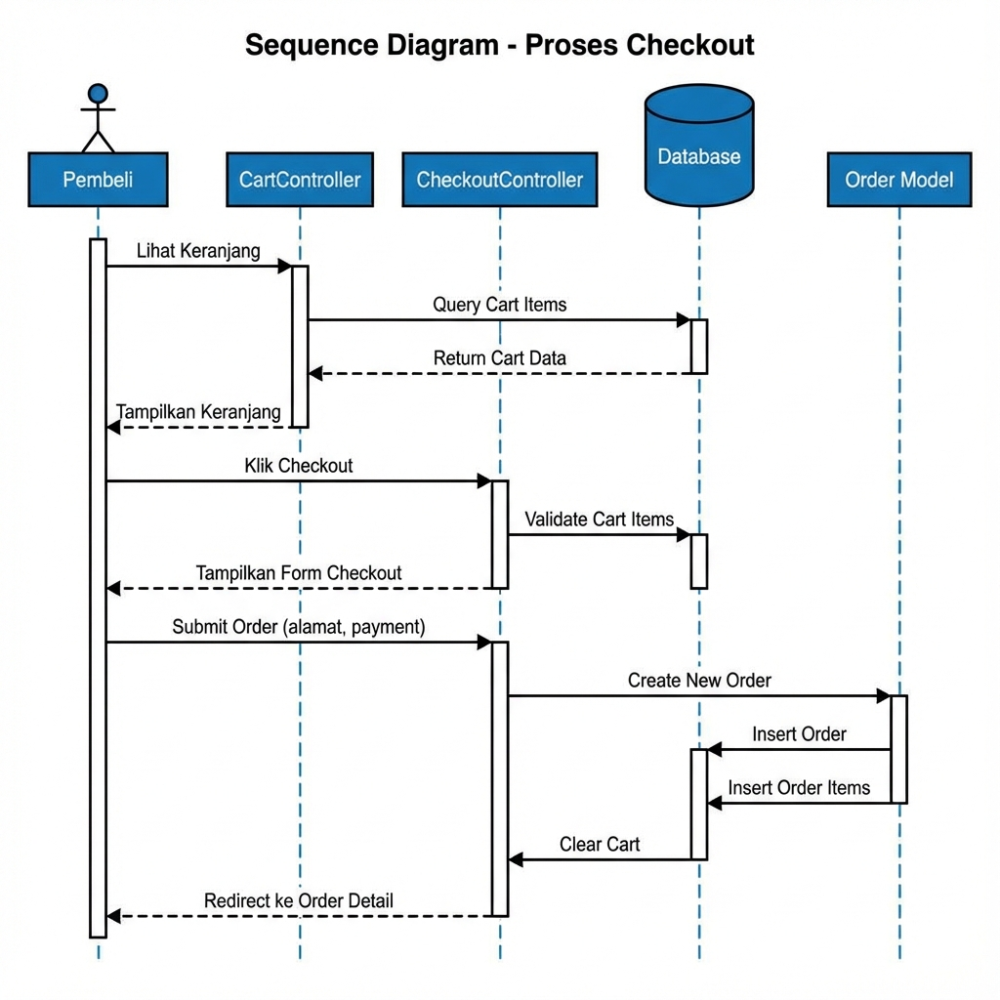
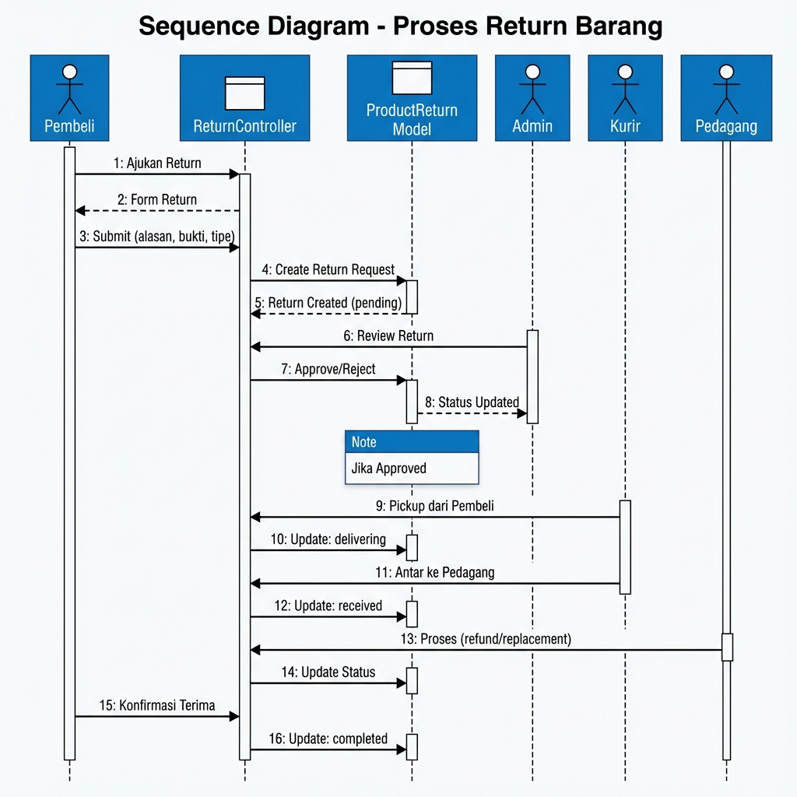

# LAPORAN PEMROGRAMAN APLIKASI BERBASIS WEB (PABW)

# SISTEM E-COMMERCE PEUKAN RUMOH

---

## 1. Pendahuluan

### 1.1 Latar Belakang

Pasar tradisional merupakan salah satu pilar perekonomian masyarakat Indonesia, khususnya bagi pelaku Usaha Mikro, Kecil, dan Menengah (UMKM). Namun, di era digital saat ini, pedagang pasar tradisional menghadapi tantangan yang semakin besar dalam bersaing dengan platform e-commerce modern. Banyak pembeli yang beralih ke platform belanja online karena kemudahan, kenyamanan, dan efisiensi waktu yang ditawarkan.

Di sisi lain, pembeli yang ingin membeli produk segar seperti sayuran, buah-buahan, daging, dan ikan sering kali kesulitan untuk mendapatkan akses langsung ke pasar tradisional karena keterbatasan waktu, jarak, atau kondisi tertentu. Kesenjangan ini menciptakan peluang untuk mengembangkan solusi teknologi yang dapat menjembatani pedagang pasar tradisional dengan pembeli modern.

**Peukan Rumoh** hadir sebagai solusi platform e-commerce marketplace yang dirancang khusus untuk menghubungkan pedagang pasar tradisional dengan pembeli secara online. Nama "Peukan Rumoh" berasal dari bahasa Aceh yang berarti "Pasar Rumah", mencerminkan konsep membawa pengalaman berbelanja pasar tradisional ke rumah pembeli melalui teknologi digital.

Platform ini dibangun menggunakan framework Laravel 11 dengan arsitektur Model-View-Controller (MVC), mendukung 4 role pengguna berbeda (Admin, Pedagang, Kurir, dan Pembeli), dan dilengkapi dengan fitur-fitur lengkap mulai dari manajemen produk, keranjang belanja, checkout, pembayaran, hingga sistem pengembalian barang (return).

### 1.2 Rumusan Masalah

Berdasarkan latar belakang di atas, rumusan masalah dalam pengembangan sistem ini adalah:

1. Bagaimana merancang dan membangun platform e-commerce yang dapat membantu pedagang pasar tradisional memasarkan produk mereka secara online?

2. Bagaimana mengimplementasikan sistem multi-role yang dapat mengakomodasi kebutuhan berbagai stakeholder (admin, pedagang, kurir, dan pembeli)?

3. Bagaimana membangun sistem manajemen pesanan yang terintegrasi dengan alur pengiriman oleh kurir?

4. Bagaimana mengimplementasikan sistem pengembalian barang (return) yang transparan dan mudah digunakan?

5. Bagaimana membangun dashboard monitoring yang komprehensif untuk setiap role pengguna?

### 1.3 Tujuan

Tujuan dari pengembangan sistem Peukan Rumoh adalah:

| No | Tujuan | Deskripsi |
|----|--------|-----------|
| 1 | **Digitalisasi UMKM** | Membantu pedagang pasar tradisional memasarkan produk secara online sehingga dapat menjangkau lebih banyak pembeli |
| 2 | **Kemudahan Akses** | Memberikan akses belanja produk segar berkualitas kepada pembeli tanpa harus datang langsung ke pasar |
| 3 | **Efisiensi Pengiriman** | Menyediakan sistem kurir terintegrasi untuk pengiriman lokal yang cepat dan terpercaya |
| 4 | **Transparansi Transaksi** | Menciptakan sistem transaksi yang aman, transparan, dan dapat dilacak dari pemesanan hingga pengiriman |
| 5 | **Manajemen Terpusat** | Admin dapat memantau dan mengelola seluruh aktivitas marketplace secara real-time |

### 1.4 Manfaat

**Manfaat bagi Pedagang:**
- Dapat menjual produk secara online tanpa biaya sewa tempat
- Mendapatkan akses ke lebih banyak pelanggan potensial
- Memiliki dashboard untuk memantau penjualan dan pendapatan
- Dapat mengelola stok dan produk dengan mudah

**Manfaat bagi Pembeli:**
- Kemudahan berbelanja produk segar dari rumah
- Dapat membandingkan harga dari berbagai pedagang
- Sistem tracking pesanan yang transparan
- Proses pengembalian barang yang mudah jika ada masalah

**Manfaat bagi Kurir:**
- Mendapatkan pekerjaan pengiriman yang terorganisir
- Sistem pickup dan delivery yang jelas
- Dashboard untuk memantau pengiriman dan pendapatan

**Manfaat bagi Admin/Platform:**
- Monitoring keseluruhan aktivitas marketplace
- Pendapatan dari admin fee setiap transaksi
- Data analitik untuk pengembangan bisnis

---

## 2. Gambaran Sistem

### 2.1 Deskripsi Umum

**Peukan Rumoh** adalah platform e-commerce marketplace berbasis web yang menghubungkan pedagang pasar tradisional dengan pembeli modern. Platform ini mendukung 4 role pengguna (Admin, Pedagang, Kurir, Pembeli) dengan fitur lengkap dari manajemen produk hingga sistem pengembalian barang.

### 2.2 Ruang Lingkup Sistem

```
┌─────────────────────────────────────────────────────────────────┐
│                     PEUKAN RUMOH SYSTEM                         │
├─────────────────────────────────────────────────────────────────┤
│  ┌─────────────┐  ┌─────────────┐  ┌─────────────┐  ┌─────────┐ │
│  │  PEMBELI    │  │  PEDAGANG   │  │   KURIR     │  │  ADMIN  │ │
│  ├─────────────┤  ├─────────────┤  ├─────────────┤  ├─────────┤ │
│  │• Registrasi │  │• Kelola     │  │• Pickup     │  │• Kelola │ │
│  │• Belanja    │  │  Produk     │  │  Pesanan    │  │  User   │ │
│  │• Keranjang  │  │• Terima     │  │• Antar      │  │• Kelola │ │
│  │• Checkout   │  │  Pesanan    │  │  Pesanan    │  │  Produk │ │
│  │• Bayar      │  │• Proses     │  │• Konfirmasi │  │• Monitor│ │
│  │• Review     │  │  Return     │  │  Delivery   │  │  Order  │ │
│  │• Return     │  │• Laporan    │  │• Return     │  │• Laporan│ │
│  └─────────────┘  └─────────────┘  └─────────────┘  └─────────┘ │
└─────────────────────────────────────────────────────────────────┘
```

### 2.3 Desain UML MVC (Tugas APSI)

Berikut adalah desain UML yang digunakan dalam pengembangan sistem:

#### 2.3.1 Use Case Diagram

Use Case Diagram menggambarkan interaksi antara aktor (Pembeli, Pedagang, Kurir, Admin) dengan sistem.



#### 2.3.2 Class Diagram (MVC)

Class Diagram menggambarkan struktur Model, View, dan Controller beserta relasinya.



#### 2.3.3 Activity Diagram - Proses Checkout

Activity Diagram menggambarkan alur aktivitas proses checkout dari keranjang hingga pembayaran.



#### 2.3.4 Sequence Diagrams

**a. Sequence Diagram - Proses Checkout**



**b. Sequence Diagram - Proses Delivery**


**c. Sequence Diagram - Proses Return**



---

## 3. Arsitektur Sistem

### 3.1 Arsitektur MVC (Model-View-Controller)

Sistem Peukan Rumoh dibangun menggunakan arsitektur MVC yang merupakan pola desain standar untuk aplikasi web modern. Arsitektur ini memisahkan aplikasi menjadi tiga komponen utama:

```
+-----------------------------------------------------------------------+
|                          ARSITEKTUR MVC                               |
+-----------------------------------------------------------------------+
|                                                                       |
|  +-------------+         +-------------+         +-------------+      |
|  |    VIEW     |<------->| CONTROLLER  |<------->|    MODEL    |      |
|  |   (Blade)   |         |    (PHP)    |         |  (Eloquent) |      |
|  +-------------+         +-------------+         +-------------+      |
|  | - auth/     |         | - AuthCtrl  |         | - User      |      |
|  | - shop/     |         | - ShopCtrl  |         | - Product   |      |
|  | - cart/     |         | - CartCtrl  |         | - Cart      |      |
|  | - checkout/ |         | - CheckCtrl |         | - Order     |      |
|  | - pembeli/  |         | - OrderCtrl |         | - OrderItem |      |
|  | - pedagang/ |         | - ProductCt |         | - Review    |      |
|  | - kurir/    |         | - DelivCtrl |         | - Return    |      |
|  | - admin/    |         | - AdminCtrl |         |             |      |
|  +-------------+         +-------------+         +-------------+      |
|         ^                       ^                       ^             |
|         |                       |                       |             |
|         +-----------------------+-----------------------+             |
|                                 |                                     |
|                        +---------------+                              |
|                        |   DATABASE    |                              |
|                        |    MySQL      |                              |
|                        +---------------+                              |
+-----------------------------------------------------------------------+
```

### 3.2 Teknologi yang Digunakan

| Komponen | Teknologi | Versi | Keterangan |
|----------|-----------|-------|------------|
| Backend | Laravel | 11.x | PHP Framework dengan Eloquent ORM |
| Frontend | Blade | - | Template Engine bawaan Laravel |
| Database | MySQL | 8.x | Relational Database |
| CSS | Vanilla CSS | - | Custom Styling tanpa framework |
| JavaScript | Vanilla JS | ES6 | Client-side Interactivity |
| Charts | Chart.js | 4.x | Visualisasi Data di Dashboard |
| Authentication | Laravel Auth + Sanctum | - | Web Auth & API Auth |
| File Storage | Laravel Storage | - | Penyimpanan File Upload |

### 3.3 Struktur Folder Project

```
peukan-rumoh/
├── app/
│   ├── Http/
│   │   ├── Controllers/
│   │   │   ├── Admin/              # Controller untuk Admin (6 files)
│   │   │   │   ├── DashboardController.php
│   │   │   │   ├── OrderController.php
│   │   │   │   ├── ProductController.php
│   │   │   │   ├── ReturnController.php
│   │   │   │   ├── ReviewController.php
│   │   │   │   └── UserController.php
│   │   │   ├── Api/                # Controller untuk REST API (4 files)
│   │   │   │   ├── AuthController.php
│   │   │   │   ├── CartController.php
│   │   │   │   ├── OrderController.php
│   │   │   │   └── ProductController.php
│   │   │   ├── Auth/               # Controller Authentication (2 files)
│   │   │   │   ├── AuthController.php
│   │   │   │   └── ForgotPasswordController.php
│   │   │   ├── Kurir/              # Controller untuk Kurir (3 files)
│   │   │   │   ├── DashboardController.php
│   │   │   │   ├── DeliveryController.php
│   │   │   │   └── ReturnController.php
│   │   │   ├── Pedagang/           # Controller untuk Pedagang (5 files)
│   │   │   │   ├── DashboardController.php
│   │   │   │   ├── OrderController.php
│   │   │   │   ├── ProductController.php
│   │   │   │   ├── ReturnController.php
│   │   │   │   └── ReviewController.php
│   │   │   ├── Pembeli/            # Controller untuk Pembeli (1 file)
│   │   │   │   └── OrderHistoryController.php
│   │   │   ├── CartController.php
│   │   │   ├── CheckoutController.php
│   │   │   ├── HomeController.php
│   │   │   ├── ProfileController.php
│   │   │   └── ShopController.php
│   │   └── Middleware/             # Custom Middleware
│   └── Models/                     # Eloquent Models (7 files)
│       ├── User.php
│       ├── Product.php
│       ├── Cart.php
│       ├── Order.php
│       ├── OrderItem.php
│       ├── Review.php
│       └── ProductReturn.php
├── database/
│   ├── migrations/                 # Database Migrations (12 files)
│   └── seeders/                    # Demo Data Seeders
├── resources/
│   └── views/                      # Blade Templates (51 files)
│       ├── admin/                  # Views Admin (14 files)
│       ├── auth/                   # Views Auth (2 files)
│       ├── cart/                   # Views Cart (1 file)
│       ├── checkout/               # Views Checkout (3 files)
│       ├── kurir/                  # Views Kurir (7 files)
│       ├── layouts/                # Layout Templates (3 files)
│       ├── partials/               # Partial Views (1 file)
│       ├── pedagang/               # Views Pedagang (12 files)
│       ├── pembeli/                # Views Pembeli (3 files)
│       ├── profile/                # Views Profile (2 files)
│       ├── shop/                   # Views Shop (2 files)
│       └── home.blade.php
├── routes/
│   ├── web.php                     # Web Routes (175 lines)
│   └── api.php                     # API Routes (50 lines)
└── public/
    └── storage/                    # File Uploads (Product Images, etc)
```

### 3.4 Pembagian Tugas per Anggota (PIC)

| Anggota | Role PIC | Komponen yang Dikerjakan |
|---------|----------|--------------------------|
| **Azhar Khairu Hafidz** | Pengelola Admin | `Admin\*Controller` (6 files), Views admin/ (14 files), Monitoring & manajemen seluruh sistem |
| **Nashrullah Al Himni** | Pengembang Pedagang & Kurir | `Pedagang\*Controller` (5 files), `Kurir\*Controller` (3 files), Views pedagang/ (12 files), Views kurir/ (7 files) |
| **Aziz Faturrahman** | Pengembang Pembeli & Inti | `Pembeli\*Controller`, `AuthController`, `CartController`, `CheckoutController`, `ShopController`, `ProfileController`, Models, Migrations, Views pembeli/, auth/, cart/, checkout/, shop/, profile/ |

---

## 4. Implementasi Sistem dan Analisis

### 4.1 Implementasi Database

#### 4.1.1 Entity Relationship Diagram (ERD)

Sistem ini memiliki 7 tabel utama dengan relasi sebagai berikut:

```
users (1) ──────────────── (N) products
users (1) ──────────────── (N) carts
users (1) ──────────────── (N) orders
users (1) ──────────────── (N) reviews
users (1) ──────────────── (N) returns
products (1) ───────────── (N) carts
products (1) ───────────── (N) order_items
products (1) ───────────── (N) reviews
orders (1) ─────────────── (N) order_items
orders (1) ─────────────── (N) reviews
orders (1) ─────────────── (N) returns
```

#### 4.1.2 Struktur Tabel Database

| No | Tabel | Deskripsi | Jumlah Kolom |
|----|-------|-----------|--------------|
| 1 | `users` | Semua pengguna sistem (pembeli, pedagang, kurir, admin) | 14 |
| 2 | `products` | Produk yang dijual pedagang | 10 |
| 3 | `carts` | Keranjang belanja | 5 |
| 4 | `orders` | Pesanan pembeli | 15 |
| 5 | `order_items` | Item dalam pesanan | 8 |
| 6 | `reviews` | Review produk | 7 |
| 7 | `returns` | Pengembalian barang | 19 |

#### 4.1.3 Contoh SQL: Tabel Users

```sql
CREATE TABLE `users` (
    `id` BIGINT UNSIGNED NOT NULL AUTO_INCREMENT PRIMARY KEY,
    `name` VARCHAR(255) NOT NULL,
    `email` VARCHAR(255) NOT NULL UNIQUE,
    `role` ENUM('pembeli', 'pedagang', 'kurir', 'admin') NOT NULL DEFAULT 'pembeli',
    `is_approved` TINYINT(1) NOT NULL DEFAULT 0,
    `phone` VARCHAR(255) NULL,
    `address` TEXT NULL,
    `store_name` VARCHAR(255) NULL,
    `store_description` TEXT NULL,
    `store_logo` VARCHAR(255) NULL,
    `email_verified_at` TIMESTAMP NULL,
    `password` VARCHAR(255) NOT NULL,
    `remember_token` VARCHAR(100) NULL,
    `created_at` TIMESTAMP NULL,
    `updated_at` TIMESTAMP NULL
) ENGINE=InnoDB DEFAULT CHARSET=utf8mb4 COLLATE=utf8mb4_unicode_ci;
```

### 4.2 Implementasi Model (Eloquent ORM)

#### 4.2.1 Ringkasan Model

| No | Model | Table | Atribut | Functions |
|----|-------|-------|:-------:|:---------:|
| 1 | `User` | `users` | 10 | 8 |
| 2 | `Product` | `products` | 8 | 8 |
| 3 | `Cart` | `carts` | 3 | 3 |
| 4 | `Order` | `orders` | 13 | 5 |
| 5 | `OrderItem` | `order_items` | 6 | 2 |
| 6 | `Review` | `reviews` | 5 | 3 |
| 7 | `ProductReturn` | `returns` | 17 | 9 |
| **Total** | | **7 Model** | **62** | **38** |

#### 4.2.2 Contoh Implementasi Model: User

```php
<?php

namespace App\Models;

use Illuminate\Foundation\Auth\User as Authenticatable;
use Illuminate\Database\Eloquent\Relations\HasMany;
use Laravel\Sanctum\HasApiTokens;

class User extends Authenticatable
{
    use HasApiTokens;

    protected $fillable = [
        'name', 'email', 'password', 'role', 'is_approved',
        'phone', 'address', 'store_name', 'store_description', 'store_logo',
    ];

    protected $hidden = ['password', 'remember_token'];

    protected $casts = [
        'email_verified_at' => 'datetime',
        'password' => 'hashed',
        'is_approved' => 'boolean',
    ];

    // Role Checking Functions
    public function isAdmin(): bool { return $this->role === 'admin'; }
    public function isPedagang(): bool { return $this->role === 'pedagang'; }
    public function isKurir(): bool { return $this->role === 'kurir'; }
    public function isPembeli(): bool { return $this->role === 'pembeli'; }

    // Relationships
    public function products(): HasMany { return $this->hasMany(Product::class); }
    public function orders(): HasMany { return $this->hasMany(Order::class); }
    public function deliveries(): HasMany { return $this->hasMany(Order::class, 'kurir_id'); }
    public function carts(): HasMany { return $this->hasMany(Cart::class); }
}
```

### 4.3 Implementasi Controller

#### 4.3.1 Ringkasan Controller per Role

| Role | Controller | Jumlah Method | Fungsi Utama |
|------|------------|:-------------:|--------------|
| **Admin** | DashboardController | 2 | Dashboard & Export Report |
| | UserController | 7 | CRUD User + Approve/Reject |
| | ProductController | 2 | Index & Show |
| | OrderController | 3 | Index, Show, UpdateStatus |
| | ReturnController | 2 | Index & Show |
| | ReviewController | 1 | Index |
| **Pedagang** | DashboardController | 2 | Dashboard & Export Report |
| | ProductController | 5 | CRUD Produk |
| | OrderController | 4 | Index, Show, Process, ReadyPickup |
| | ReturnController | 6 | CRUD & Handle Return |
| | ReviewController | 1 | Index |
| **Kurir** | DashboardController | 1 | Dashboard |
| | DeliveryController | 4 | Index, History, Show, Pickup, Deliver |
| | ReturnController | 5 | Handle Return Pickup & Delivery |
| **Pembeli** | OrderHistoryController | 7 | Orders, Reviews, Returns |
| **Shared** | AuthController | 4 | Login, Register, Logout |
| | CartController | 5 | Cart CRUD |
| | CheckoutController | 5 | Checkout Flow |
| | ShopController | 2 | Browse Products |
| | ProfileController | 3 | Profile Management |

#### 4.3.2 Contoh Implementasi Controller: CartController

```php
<?php

namespace App\Http\Controllers;
    
use App\Models\Cart;
use App\Models\Product;
use Illuminate\Http\Request;

class CartController extends Controller
{
    public function index()
    {
        $carts = auth()->user()->carts()->with('product.user')->get();
        $subtotal = $carts->sum(fn($cart) => $cart->product->price * $cart->quantity);
        
        return view('cart.index', compact('carts', 'subtotal'));
    }

    public function add(Request $request, Product $product)
    {
        $request->validate(['quantity' => 'required|integer|min:1']);

        $cart = Cart::updateOrCreate(
            ['user_id' => auth()->id(), 'product_id' => $product->id],
            ['quantity' => $request->quantity]
        );

        return back()->with('success', 'Produk ditambahkan ke keranjang!');
    }

    public function update(Request $request, Cart $cart)
    {
        $request->validate(['quantity' => 'required|integer|min:1']);
        $cart->update(['quantity' => $request->quantity]);
        
        return back()->with('success', 'Keranjang diperbarui!');
    }

    public function remove(Cart $cart)
    {
        $cart->delete();
        return back()->with('success', 'Produk dihapus dari keranjang!');
    }

    public function clear()
    {
        auth()->user()->carts()->delete();
        return back()->with('success', 'Keranjang dikosongkan!');
    }
}
```

### 4.4 Implementasi Views (Blade Templates)

#### 4.4.1 Ringkasan Views per Modul

| Modul | Jumlah Views | Deskripsi |
|-------|:------------:|-----------|
| Admin | 14 | Dashboard, Users, Products, Orders, Returns, Reviews |
| Pedagang | 12 | Dashboard, Products CRUD, Orders, Returns, Reviews |
| Kurir | 7 | Dashboard, Deliveries, Returns |
| Pembeli | 3 | Order History, Order Detail, Return Form |
| Auth | 2 | Login, Register |
| Shop | 2 | Product List, Product Detail |
| Cart | 1 | Shopping Cart |
| Checkout | 3 | Checkout, Payment, Success |
| Profile | 2 | Profile View, Edit |
| Layouts | 3 | App, Dashboard, Main |
| Partials | 1 | Navbar |
| **Total** | **51** | |

### 4.5 Implementasi Routing

#### 4.5.1 Web Routes (routes/web.php)

| Prefix | Middleware | Jumlah Routes | Deskripsi |
|--------|------------|:-------------:|-----------|
| `/` | guest | 6 | Login, Register, Forgot Password |
| `/` | auth | 15 | Home, Shop, Cart, Checkout, Profile, Orders |
| `/admin` | auth, admin | 13 | Admin Dashboard & Management |
| `/pedagang` | auth, pedagang, approved | 12 | Pedagang Dashboard & Management |
| `/kurir` | auth, kurir, approved | 10 | Kurir Dashboard & Deliveries |

#### 4.5.2 API Routes (routes/api.php)

| Method | Endpoint | Auth | Deskripsi |
|--------|----------|:----:|-----------|
| POST | `/register` | No | Register user baru (name, email, phone, address, password) |
| POST | `/login` | No | Login & get token |
| GET | `/products` | No | List semua produk |
| GET | `/products/{id}` | No | Detail produk |
| POST | `/logout` | Yes | Logout |
| GET | `/user` | Yes | Get current user |
| PUT | `/user/update` | Yes | Update profile |
| PUT | `/user/change-password` | Yes | Ganti password |
| GET | `/cart` | Yes | Lihat keranjang |
| POST | `/cart` | Yes | Tambah ke keranjang |
| PUT | `/cart/{id}` | Yes | Update keranjang |
| DELETE | `/cart/{id}` | Yes | Hapus dari keranjang |
| GET | `/orders` | Yes | Riwayat pesanan (termasuk return status) |
| POST | `/orders` | Yes | Buat pesanan baru |
| POST | `/orders/{id}/payment` | Yes | Konfirmasi pembayaran |
| POST | `/orders/{id}/confirm-delivery` | Yes | Konfirmasi penerimaan pesanan |
| POST | `/orders/{id}/review` | Yes | Submit review produk |
| POST | `/orders/{id}/return` | Yes | Ajukan return dengan foto bukti |
| POST | `/orders/{id}/confirm-replacement` | Yes | Konfirmasi barang pengganti diterima |
| POST | `/orders/{id}/confirm-refund` | Yes | Konfirmasi dana refund diterima |

### 4.6 Alur Bisnis Sistem

#### 4.6.1 Alur Pemesanan (Order Flow)

```
+----------+    +----------+    +----------+    +----------+    +----------+
| Pembeli  |--->| Belanja  |--->| Checkout |--->|  Bayar   |--->| Pesanan  |
| Register |    | Produk   |    | & Order  |    |          |    | Dibuat   |
+----------+    +----------+    +----------+    +----------+    +----+-----+
                                                                     |
    +----------------------------------------------------------------+
    v
+----------+    +----------+    +----------+    +----------+    +----------+
| Pedagang |--->|  Proses  |--->| Kurir    |--->| Antar ke |--->| Pesanan  |
| Terima   |    |  Pesanan |    | Pickup   |    | Pembeli  |    | Selesai  |
+----------+    +----------+    +----------+    +----------+    +----------+
```

#### 4.6.2 Status Flow Pesanan

| Status | Deskripsi | Actor |
|--------|-----------|-------|
| `pending` | Pesanan dibuat, menunggu pembayaran | Pembeli |
| `paid` | Pembayaran dikonfirmasi | Pembeli |
| `processing` | Sedang diproses oleh pedagang | Pedagang |
| `ready_pickup` | Siap diambil kurir | Pedagang |
| `shipped` | Dalam pengiriman | Kurir |
| `delivered` | Sampai di tujuan | Kurir |
| `completed` | Pesanan selesai | Pembeli |
| `cancelled` | Pesanan dibatalkan | Pembeli/Admin |

#### 4.6.3 Alur Pengembalian (Return Flow)

```
+----------+    +----------+    +----------+    +----------+    +----------+
| Pembeli  |--->| Pedagang |--->|  Kurir   |--->| Pedagang |--->| Selesai  |
| Request  |    | Approve  |    | Pickup   |    | Terima   |    | Refund/  |
| Return   |    |          |    | Barang   |    | Barang   |    | Replace  |
+----------+    +----------+    +----------+    +----------+    +----------+
```

### 4.7 Analisis Fitur per Role

#### 4.7.1 Fitur Pembeli

| No | Fitur | Deskripsi |
|----|-------|-----------|
| 1 | Registrasi & Login | Mendaftar akun baru (nama, email, nomor HP, alamat, password) dan login dengan email/password |
| 2 | Browse Produk | Melihat katalog produk dengan filter kategori |
| 3 | Keranjang Belanja | Mengelola item di keranjang sebelum checkout |
| 4 | Checkout & Pembayaran | Proses pemesanan dengan pilihan metode bayar (COD, Transfer, E-Wallet) |
| 5 | Tracking Pesanan | Melacak status pesanan dari pending hingga completed |
| 6 | Konfirmasi Diterima | Konfirmasi penerimaan pesanan (status: delivered → completed) |
| 7 | Review Produk | Memberikan rating (1-5 bintang) dan ulasan setelah pesanan selesai |
| 8 | Request Return | Mengajukan pengembalian barang dengan upload foto bukti |
| 9 | Konfirmasi Pengganti | Konfirmasi penerimaan barang pengganti dari return |
| 10 | Konfirmasi Refund | Konfirmasi penerimaan dana pengembalian |

#### 4.7.2 Fitur Pedagang

| No | Fitur | Deskripsi |
|----|-------|-----------|
| 1 | Dashboard Statistik | Melihat pendapatan, grafik penjualan, produk terlaris |
| 2 | Manajemen Produk | CRUD produk dengan gambar, kategori, dan stok |
| 3 | Kelola Pesanan | Menerima dan memproses pesanan masuk |
| 4 | Handle Return | Approve/reject permintaan pengembalian |
| 5 | Monitor Review | Melihat ulasan produk dari pembeli |
| 6 | Export Laporan | Download laporan penjualan dalam PDF |

#### 4.7.3 Fitur Kurir

| No | Fitur | Deskripsi |
|----|-------|-----------|
| 1 | Dashboard | Statistik pengiriman dan pendapatan |
| 2 | Pickup Pesanan | Mengambil pesanan dari pedagang |
| 3 | Delivery | Mengantar pesanan ke pembeli |
| 4 | Riwayat Pengiriman | Melihat history pengiriman |
| 5 | Handle Return | Pickup barang return dan antar pengganti |

#### 4.7.4 Fitur Admin

| No | Fitur | Deskripsi |
|----|-------|-----------|
| 1 | Dashboard Monitoring | Statistik keseluruhan sistem |
| 2 | Manajemen User | CRUD user + approve/reject pedagang & kurir |
| 3 | Monitor Produk | Melihat semua produk di platform |
| 4 | Monitor Pesanan | Melihat semua pesanan dan update status |
| 5 | Monitor Return | Melihat semua permintaan return |
| 6 | Monitor Review | Melihat semua ulasan |
| 7 | Export Laporan | Download laporan bulanan PDF |

### 4.8 Keamanan Sistem

| Aspek | Implementasi |
|-------|--------------|
| CSRF Protection | Laravel CSRF Token pada semua form |
| Password Hashing | Bcrypt hashing via Laravel |
| Role-based Access Control | Middleware untuk setiap role |
| API Authentication | Laravel Sanctum untuk token-based auth |
| Input Validation | Request validation pada setiap controller |
| File Upload Validation | Validasi tipe dan ukuran file (max 10MB) |

---

## 5. Deklarasi Penggunaan AI oleh Mahasiswa

Kami, anggota kelompok pengembang sistem Peukan Rumoh, menggunakan teknologi AI dalam proses pengembangan aplikasi ini sebagai berikut:

### 5.1 Tools AI yang Digunakan

| No | Tool AI | Kegunaan |
|----|---------|----------|
| 1 | GitHub Copilot / Vs Code AI | Completion kode, saran implementasi, Pengembangan fitur |
| 2 | ChatGPT / Claude | Konsultasi arsitektur, debugging, penjelasan konsep |

### 5.2 Batasan Penggunaan

1. **AI digunakan sebagai alat bantu**, bukan pengganti pemahaman konsep
2. **Penyesuaian dan modifikasi** dilakukan sesuai kebutuhan spesifik sistem
3. AI digunakan untuk **mempercepat development**, bukan menggantikan proses belajar
4. **Review dan testing** tetap dilakukan secara manual

---

## 6. Kesimpulan

### 6.1 Ringkasan Pencapaian

Pengembangan sistem e-commerce **Peukan Rumoh** telah berhasil mencapai tujuan-tujuan yang ditetapkan:

1. **Platform Multi-Role**: Sistem berhasil mengimplementasikan 4 role pengguna (Admin, Pedagang, Kurir, Pembeli) dengan hak akses dan fitur yang berbeda untuk masing-masing role.

2. **Arsitektur MVC**: Aplikasi dibangun dengan arsitektur Model-View-Controller yang terstruktur menggunakan Laravel 11, memudahkan maintenance dan pengembangan lebih lanjut.

3. **Fitur E-Commerce Lengkap**: Sistem menyediakan fitur lengkap mulai dari katalog produk, keranjang belanja, checkout, pembayaran, tracking pesanan, review, hingga pengembalian barang.

4. **Dashboard Monitoring**: Setiap role memiliki dashboard dengan statistik yang relevan untuk membantu pengambilan keputusan.

5. **REST API**: Tersedia API untuk integrasi dengan aplikasi mobile atau pihak ketiga.

### 6.2 Statistik Pengembangan

| Komponen | Jumlah |
|----------|:------:|
| Model | 7 |
| Controller | 21 |
| Views (Blade) | 51 |
| Database Tables | 7 (utama) + 5 (support) |
| Web Routes | 56 |
| API Endpoints | 13 |
| Total Atribut Model | 62 |
| Total Functions Model | 38 |

### 6.3 Saran Pengembangan

Untuk pengembangan lebih lanjut, sistem dapat ditingkatkan dengan:

1. **Notifikasi Real-time**: Implementasi WebSocket untuk notifikasi pesanan real-time
2. **Payment Gateway**: Integrasi dengan payment gateway seperti Midtrans atau Xendit
3. **Mobile App**: Pengembangan aplikasi mobile native menggunakan Flutter atau React Native
4. **Chat Feature**: Fitur chat antara pembeli dan pedagang
5. **Analytics Dashboard**: Dashboard analitik yang lebih komprehensif dengan BI tools
6. **Multi-language Support**: Dukungan multi bahasa (Indonesia, English)
7. **Geolocation**: Integrasi dengan Google Maps untuk tracking pengiriman

### 6.4 Penutup

Sistem Peukan Rumoh berhasil menjadi solusi yang menjembatani pedagang pasar tradisional dengan pembeli modern melalui platform digital. Dengan arsitektur yang solid dan fitur yang lengkap, sistem ini siap untuk diimplementasikan dan dikembangkan lebih lanjut sesuai kebutuhan bisnis.

---
